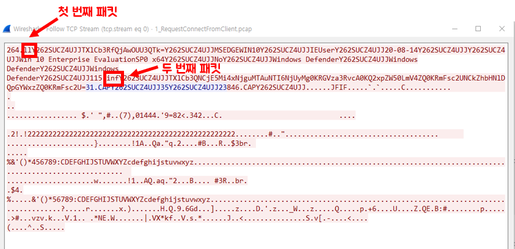

# 패킷 설명
| 패킷 이름 | 내용 | 분석관점 |
| ------ | ---------- | -------|
| 1_RequestConnectFromClient.pcap | 감염된 클라이언트가 세션생성 요청 | ii, inf 명령어 |

 

# 패킷 분석
## 1_RequestConnectFromClient
* njrat를 실행한 피해자가 공격자 서버와 세션연결 요청

   

